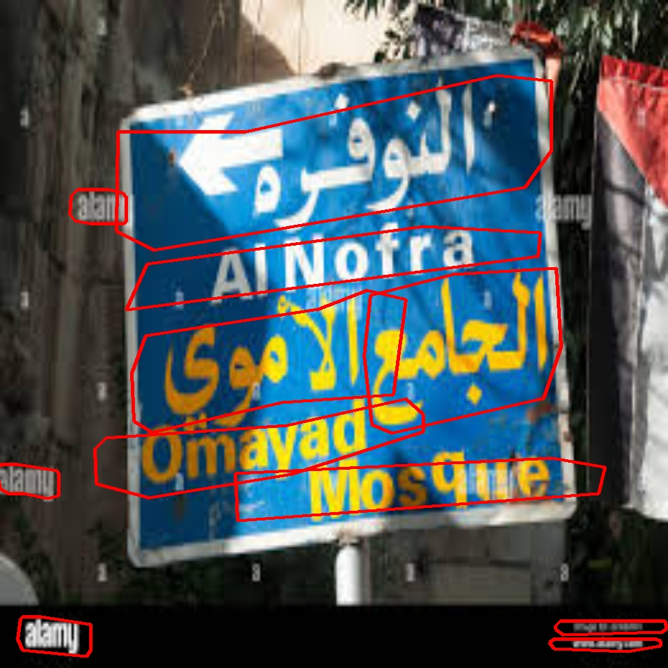
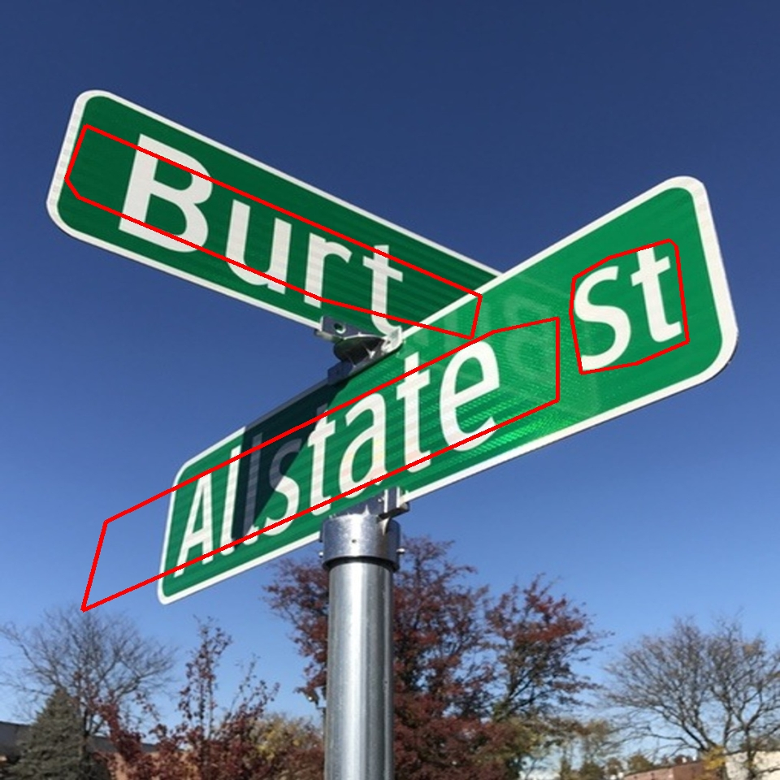
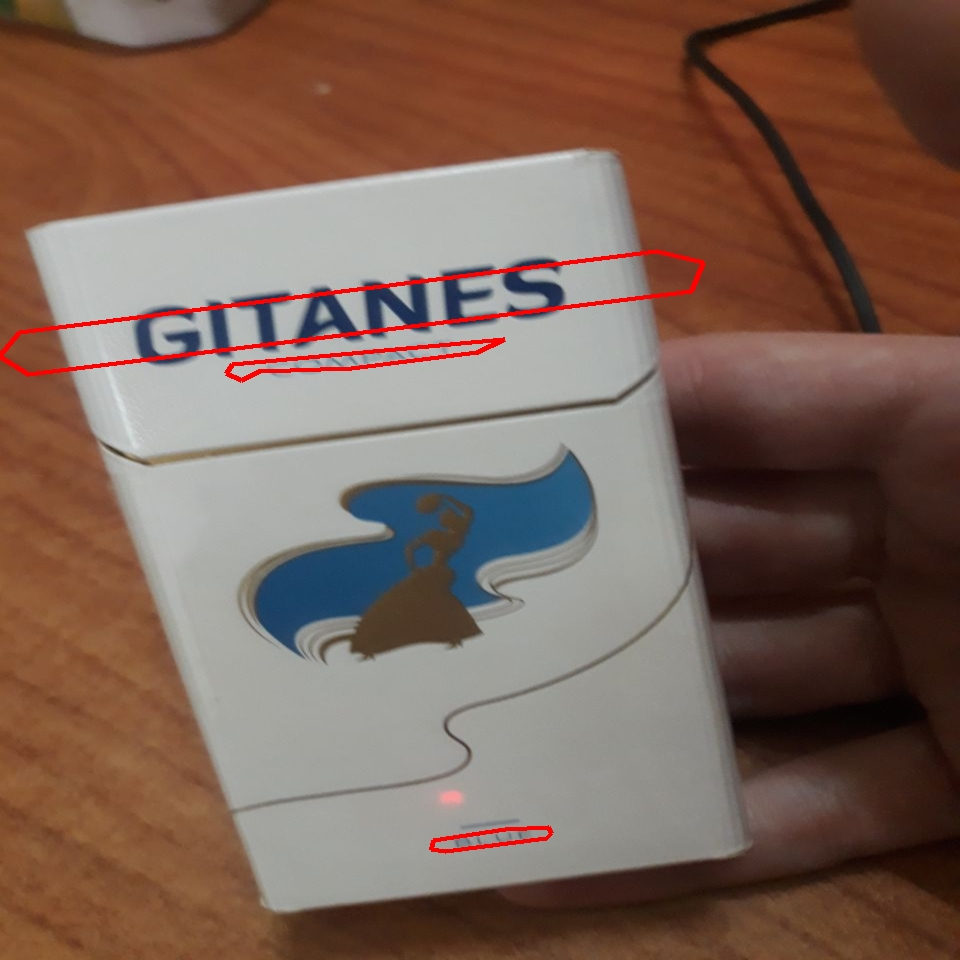
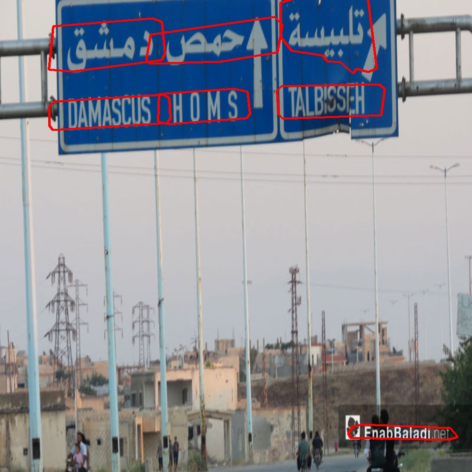

# 📝 Text Detection Demo

A simple and user-friendly text detection application built with Python (Streamlit) and ONNX Runtime. This project demonstrates real-time text detection capabilities using the PP-OCRv3 model, providing an intuitive web interface for users to upload and analyze images.



## ✨ Features

- 🌍 **Multi-language Support**: Detect text in multiple languages
- 🖼️ **Image Upload**: Support for JPG, PNG, and JPEG formats
- 📊 **Interactive UI**: User-friendly Streamlit interface
- 🚀 **ONNX Runtime**: Optimized inference using ONNX Runtime
- 🎨 **Visual Results**: Clear visualization of detected text regions

## 🛠️ Project Structure

```
Text-Detection-Demo/
├── src/
│   ├── detection/      # Text detection logic
│   ├── loader/         # Model loading utilities
│   ├── postprocessing/ # Post-processing operations
│   ├── preprocessing/  # Image preprocessing
│   ├── ui/            # Streamlit UI components
│   ├── app.py         # Main application
│   └── config.py      # Configuration settings
├── models/            # ONNX model files
└── screenshots/       # Demo screenshots
```

## 🚀 Getting Started

### Prerequisites

- Python 3.7+ (Tested on 3.9)
- pip (Python package manager)

### Installation

1. Clone the repository:
```bash
git clone https://github.com/Almouhannad/Text-Detection-Demo.git
cd Text-Detection-Demo
```

2. Install dependencies:
```bash
pip install -r requirements.txt
```

3. Download the model from [here](https://paddlepaddle.github.io/PaddleOCR/main/en/ppocr/model_list.html) and convert it to ONNX format and put it in `models` directory
    - For more details see [this repo](https://github.com/PaddlePaddle/PaddleOCR/tree/main/deploy/paddle2onnx)

### Running the Application

```bash
streamlit run src/app.py
```

## 📸 Screenshots

<div align="center">
  
  
  
</div>

## ⚙️ Configuration

Key parameters can be adjusted in `src/config.py`:

- `IMAGE_SIZE`: Input image dimensions (default: 960x960)
- `BOX_THRESH`: Detection confidence threshold (default: 0.2)
- `MIN_AREA`: Minimum area for text regions (default: 300)
- `POLY_EPS_RATIO`: Polygon approximation ratio (default: 0.01)
- `UNCLIP_RATIO`: Text region expansion ratio (default: 1.8)

## 🤝 Contributing

Contributions are welcome! Please feel free to submit a Pull Request.


## 🙏 Acknowledgments

- ChatGPT
- PP-OCRv3 model from PaddleOCR
- ONNX Runtime for efficient inference
- Streamlit for the web interface
- My friends because they are supportive

---

Made with ❤️ by Almouhannad Hafez